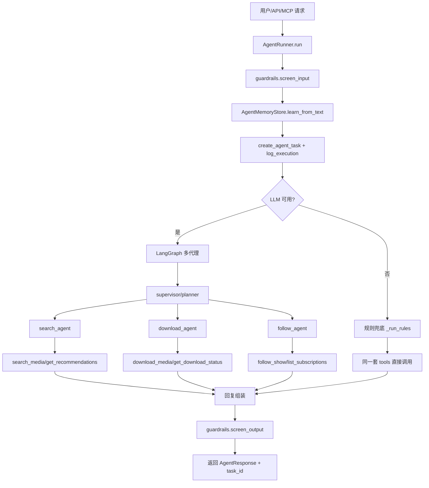
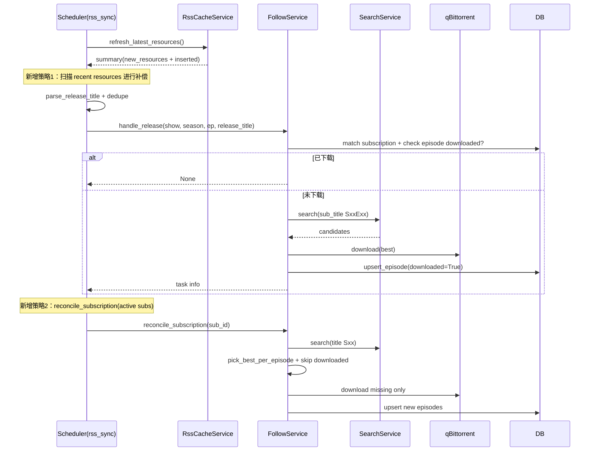

# AIMediaAssistant Agent 学习图与实战说明

本文档用于系统学习本项目的 Agent 架构，并记录近期“自动追剧漏追/防重复/目录规范化”的实战优化。

## 1. 一图看懂请求执行链路

## 2. 自动追剧（Scheduler）链路学习图

## 3. 近期问题与优化总结（你本次学习重点）

### 3.1 现象
- 第 3 集更新后没有自动加入下载。
- 历史上出现“已更新但漏追”问题。
- 下载目录包含中文，不利于跨系统管理。

### 3.2 根因
- 仅靠“new_resources”触发自动追剧，历史漏处理资源不会再被扫描。
- 订阅标题与发布标题形态不一致（英文主标题 + 中文别名），匹配容易漏。
- 保存路径使用用户输入标题，中文路径不统一。

### 3.3 已落地的优化
- 自动补偿：rss_sync 除了 new_resources，还会扫描 recent resources。
- 主动对账：每次 rss_sync 对 active subscriptions 执行 reconcile_subscription。
- 防重复：
  - 同一订阅同一 S/E 已下载则跳过。
  - 对账流程基于 episode key `(season, episode)` 去重，避免同一集不同版本重复下。
  - 重复执行 reconcile 不会二次下同一集。
- 路径标准化：
  - TV 保存目录统一为英文点分风格：`/downloads/video/tv/<English.Show.Name>/Season XX/`
  - 示例：`/downloads/video/tv/House.of.the.Dragon/Season 03/`

## 4. Agent 目录逐文件说明

### 4.1 运行入口与编排
- `src/ai_media_assistant/agent/runner.py`
  - Agent 唯一入口，负责 guardrail、记忆学习、任务日志、图模式与规则模式切换。
- `src/ai_media_assistant/agent/graph.py`
  - LangGraph 多代理图：supervisor 决策 worker（search/download/follow）。
- `src/ai_media_assistant/agent/tools.py`
  - 把服务层能力封装成 LLM 可调用工具，统一 JSON 返回结构。

### 4.2 模型与向量能力
- `src/ai_media_assistant/agent/llm.py`
  - 按配置构建 LLM（Ollama/OpenAI/禁用）。
- `src/ai_media_assistant/agent/embeddings.py`
  - Embeddings 工厂，支持 Ollama/OpenAI/离线 hashing fallback。
- `src/ai_media_assistant/agent/rag.py`
  - 向量检索基础模块：`SimpleVectorIndex` + `ScoredDocument` + 可选 Chroma。

### 4.3 安全与记忆
- `src/ai_media_assistant/agent/guardrails.py`
  - 输入输出安全过滤、外部文本注入检测与净化。
- `src/ai_media_assistant/agent/memory.py`
  - 用户偏好长期记忆抽取与存储（分辨率/质量/题材等）。

### 4.4 包导出
- `src/ai_media_assistant/agent/__init__.py`
  - 对外统一导出核心能力（get_llm/get_embeddings/AgentMemoryStore）。

## 5. 如何继续深入学习

1. 从 `runner.py` 读起，先掌握“单次请求生命周期”。
2. 再看 `tools.py`，理解 Agent 与业务服务的边界。
3. 再看 `graph.py`，理解 supervisor-worker 决策与迭代。
4. 最后看 `rag.py` 与 `memory.py`，掌握“检索 + 个性化”闭环。

## 6. 关键实践原则（避免漏追与重复）

- 不能只靠事件触发，必须叠加周期性 reconcile。
- episode 粒度去重是最重要的幂等键：`(subscription_id, season, episode)`。
- 匹配时同时使用解析标题与原始标题文本，降低中英混排漏匹配。
- 路径命名优先稳定、可移植、可排序（英文 + 点分 + Season 两位数）。
